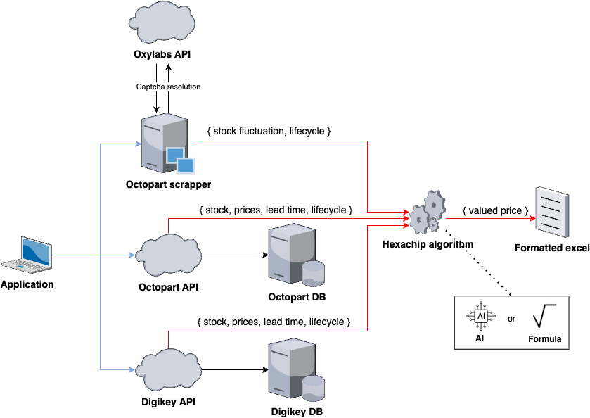

# Hexachip: Price Valuation Algorithm 
This is an algorithm that calculate the valued price of chips components.
It is based on market conditions such as market price, world stock, life cycle, lead time and date code.


## Table of Contents
- [Prerequisites](#prerequisites)
- [Getting Started](#getting-started)
  - [1. Clone the repository](#1-clone-the-repository)
  - [2. Install Python 3.11.7](#2-install-python-3117)
    - [Windows or Mac](#windows-or-mac)
    - [Linux](#linux)
    - [MAC with pyenv](#mac-with-pyenv)
  - [3. Create a virtual environment](#3-create-a-virtual-environment)
  - [4. Activate the virtual environment](#4-activate-the-virtual-environment)
  - [5. Install the requirements](#5-install-the-requirements)
  - [6. Create a .env file](#6-create-a-env-file)
  - [7. Run the program](#7-run-the-program)
- [Authors](#authors)
## Prerequisites
- Python 3.11.7 (doesn't work with Python 3.12+)
- Git

## Getting Started

### 1. Clone the repository
Download git if you don't have it: 
```https://git-scm.com/downloads```

Execute the following command:
```git clone https://github.com/lucasvry/Hexachip_poc```

### 2. Install Python 3.11.7

#### Windows or Mac 
You can download it from the official website:
```https://www.python.org/downloads/```

#### Linux
Execute the following linux command:
```sudo apt-get install python3.11.7```

#### MAC with pyenv
Execute this command: 
```pyenv install 3.11.7``` and ```pyenv global 3.11.7```

### 3. Create a virtual environment
Go in the project folder:
```cd Hexachip_poc```

Then create the virtual environment:
```python -m venv venv```

### 4. Activate the virtual environment
Activate the virtual environment:
```venv\Scripts\activate```

### 5. Install the requirements
Execute the following command:
```pip install -r requirements.txt```

### 6. Create a .env file
Copy the .env.dist file and rename it to .env. Then fill the environment variables.
For that you have to create an Digikey and Octopart account and get the API credentials.
- Octopart API URL: https://portal.nexar.com/signup (you need the bearer token)
- Digikey API URL: https://developer.digikey.com/ (you need the client id and the client secret)

### 7. Run the program
Execute the following command:

```cd src```

```python main.py```

## Authors
- **[Lucas SAVARY](https://github.com/lucasvry)** - Software engineer
- **[Jules MARCHE](https://github.com/julesmarche)** - Software engineer
- **[Mathis PLANCHET](https://github.com/TechNalp)** - Software engineer
- **[Louan BELICAUD](https://github.com/louanbel)** - Software engineer
